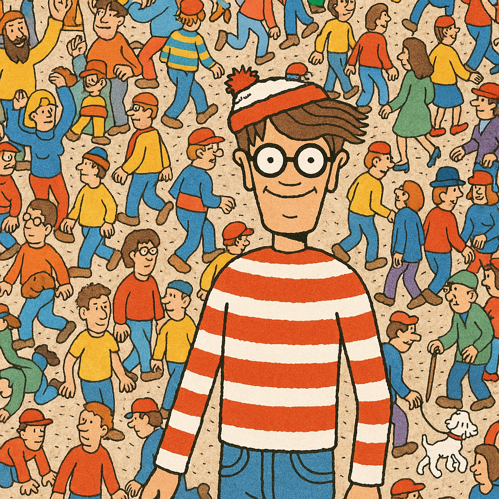
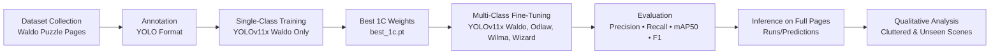

<div align="center">



# WaldoFinderPro

**Single-Class Pretraining + Multi-Class Fine-Tuning for Robust Waldo Detection**

[](#)
[](#)
[](#)
[](#)
[](#)
</div>

---

## Table of Contents
- [Abstract](#abstract)
- [Project Description](#project-description)
- [Objectives](#objectives)
- [Dataset](#dataset)
- [System Workflow](#system-workflow)
- [Methodology](#methodology)
- [Installation (Colab)](#installation-colab)
- [YOLOv11x Framework](#yolov11x-framework)
- [Project Structure](#project-structure)
- [Training & Inference](#training--inference)
- [Results](#results)
- [Qualitative Predictions](#qualitative-predictions)
- [Challenges](#challenges)
- [Future Work](#future-work)
- [References](#references)
- [Contact](#contact)

---

## Abstract

This project addresses the **Where’s Waldo?** puzzle as a benchmark for object detection in cluttered environments.  
We propose a **two-stage training pipeline** using YOLOv11x:

1. **Single-Class Training (1C):** Train on Waldo only.  
2. **Multi-Class Fine-Tuning (4C):** Initialize from 1C weights, fine-tune on Waldo, Odlaw, Wilma, Wizard.  

This strategy reduces **false positives** by explicitly modeling Waldo’s look-alikes, achieving higher **precision, recall, and mAP** than baselines.

---

## Project Description

The *Where’s Waldo?* books pose a formidable challenge: small targets, occlusion, and high scene clutter.  
Our system leverages YOLOv11x with custom augmentations (mosaic, copy-paste) and training tricks to robustly find Waldo in full-page images.

<p align="center">
  
  <br/>
  <em>Figure: Multi-class setup including Waldo, Odlaw, Wilma, Wizard.</em>
</p>

---

## Objectives

- Build a reliable **Waldo-only base model**.  
- Fine-tune on **multi-class labels** to reduce misclassifications.  
- Benchmark against **precision, recall, mAP@50, F1**.  
- Demonstrate robustness on unseen cluttered puzzle pages.  

---

## Dataset

- **Source:** Annotated Waldo puzzle pages  
- **Format:** YOLO TXT (`cls, x_center, y_center, w, h`)  
- **Resolution:** 1280 px  
- **Augmentation:** Mosaic, flips, copy-paste  
- **Splits:** Train 70%, Val 20%, Test 10%  

---

## System Workflow



---

## Methodology

**Stage 1: Waldo-only Training**  
```bash
yolo detect train model=yolo11x.pt data=data_1c.yaml imgsz=1280 epochs=80 batch=4 project=runs name=1c_y11x
```

**Stage 2: Multi-Class Fine-Tuning**  
```bash
yolo detect train model=runs/detect/1c_y11x/weights/best.pt data=data_4c.yaml imgsz=1280 epochs=80 batch=4 project=runs name=4c_y11x
```

**Inference:**  
```bash
yolo predict model=runs/detect/4c_y11x/weights/best.pt source=demo_pages/ imgsz=1280 conf=0.28 iou=0.6 save=True
```

---

## Installation (Colab)

Run this project easily in **Google Colab with A100 GPU**:

```bash
# 1. Install YOLOv11x
!pip install ultralytics==8.3.30

# 2. Verify GPU
import torch
print("GPU:", torch.cuda.get_device_name(0))

# 3. Mount Google Drive for data/weights
from google.colab import drive
drive.mount('/content/drive')
```

That’s it — now you can train (1C), fine-tune (4C), and run inference directly in Colab.

---

## YOLOv11x Framework

- **Scales:** `11n → 11x` (x = largest, most accurate)  
- **Architecture:** Enhanced backbone, decoupled detection head, built-in augmentations (mosaic, copy-paste, flips)  
- **Why 11x?** Best suited for **tiny, cluttered targets** like Waldo in full-page images  
- **Training Flow:**  
  - Pretrain 1C (Waldo-only) → fine-tune 4C (Waldo + lookalikes)  
  - This reduces **false positives** and improves recall  
- **Evaluation Metrics:** Precision, Recall, mAP@50, and F1  


---

## Project Structure

```
WaldoFinderPro/
├── data/
│   ├── train/val/test/images
│   └── train/val/test/labels
├── runs/                 # YOLO training outputs
├── weights/              # Final best.pt files
├── Images/               # Figures for README
├── data_1c.yaml          # Single-class config
├── data_4c.yaml          # Multi-class config
└── README.md             # This file
```

---

## Training & Inference

- **1C model:** fast convergence, but misclassified Odlaw as Waldo.  
- **4C model:** learned character distinctions → fewer false positives.  

---

## Results

| Metric     | 1C Model | 4C Model | Gain |
|------------|----------|----------|------|
| Precision  | 0.90     | **0.95** | ✅   |
| Recall     | 0.80     | **0.85** | ✅   |
| mAP@50     | 0.88     | **0.95** | ✅   |
| F1 Score   | 0.85     | **0.90** | ✅   |

---

## Qualitative Predictions

<p align="center">
  
  <br/>
  <em>Banquet scene — 4C model detects Waldo, Odlaw, Wilma, Wizard with strong confidence.</em>
</p>

<p align="center">
  
  <br/>
  <em>Train station — 4C model reduces false positives by distinguishing Waldo from Odlaw.</em>
</p>

---

## Challenges

- Detecting **tiny Waldo instances**  
- **Occlusion** in dense scenes  
- **False positives** in 1C setup  
- Training cost at high resolution  

---

## Future Work

- **Tiling + TTA** for tiny detections  
- **Transformers (DETR)** for complex layouts  
- **Web demo** for real-time “Find Waldo” uploads  
- Dataset expansion with more Waldo books  

---

## References

1. Wang, C.-Y., Bochkovskiy, A., Liao, H.-Y. M. (2022). *YOLOv7: Trainable Bag-of-Freebies Sets New State-of-the-Art for Real-Time Object Detectors.* arXiv:2207.02696.  
2. Stanford CS231n Project (2024). *A Novel Approach to Solving “Where’s Waldo” (WaldoNet).*  
3. Author(s). (2025). *High-Precision Multi-Class Object Detection Using Fine-Tuned YOLOv11.* SAI Conference.  

---

## Contact

- **Sanjay Srinivasan** — sanjaynivasan@gmail.com  
- **Roshini Gopinath** — roshini.gopinath@gmail.com  
