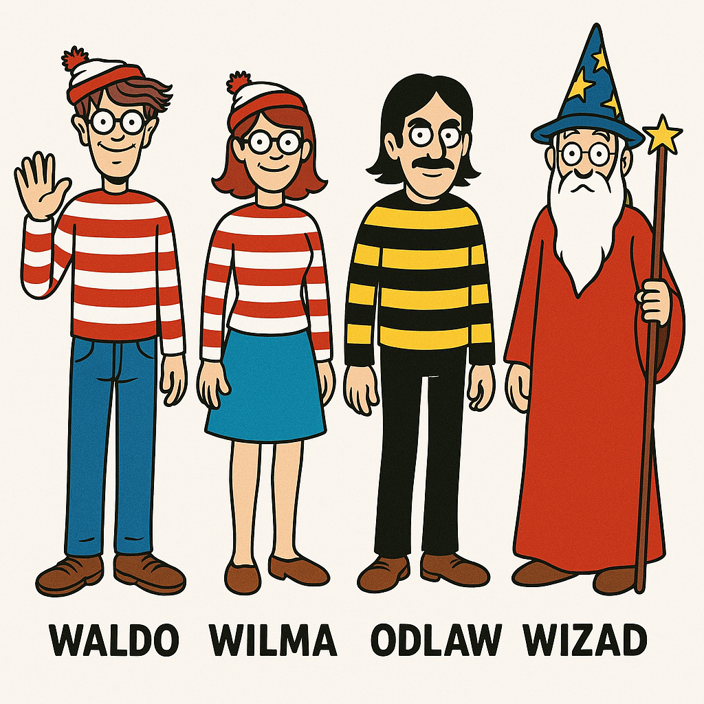
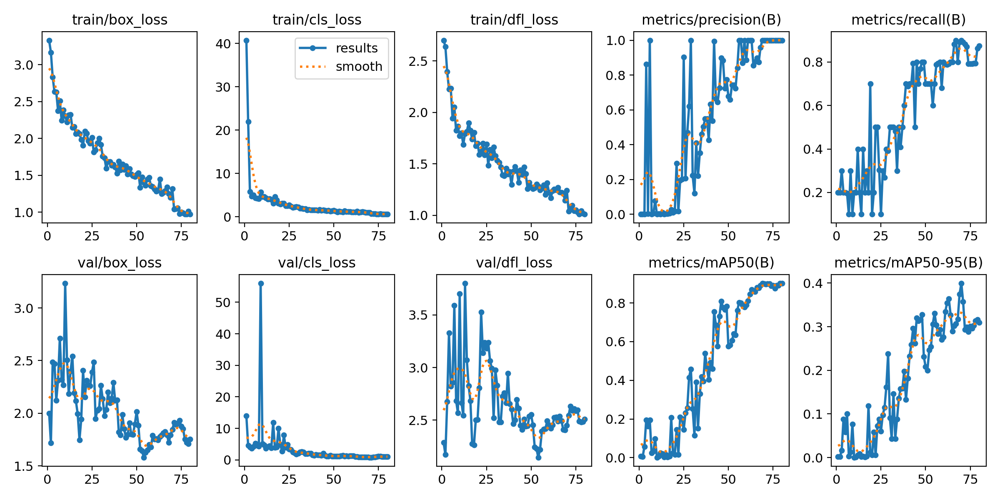
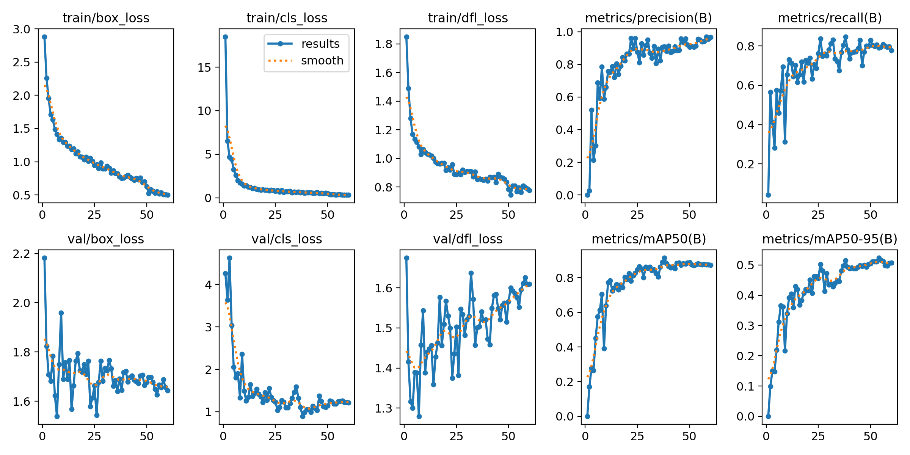
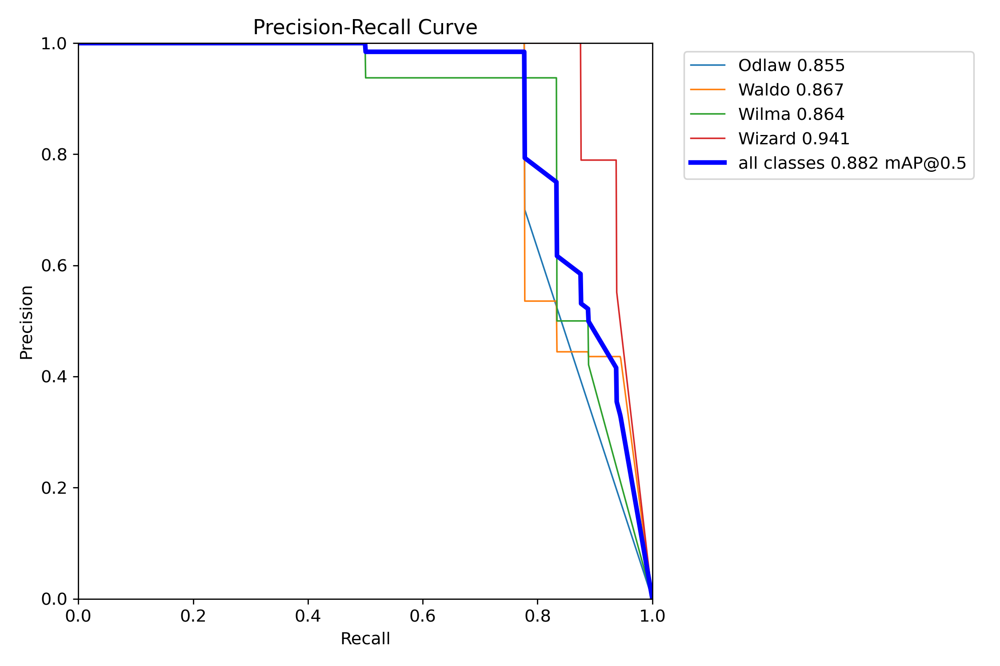
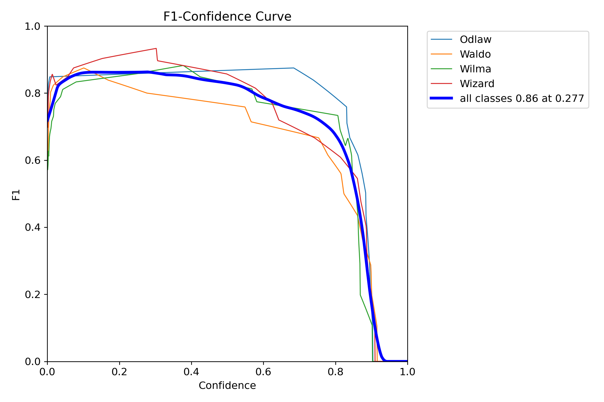
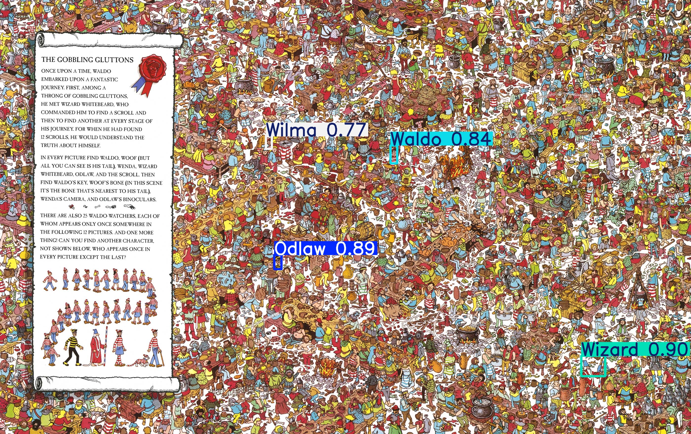
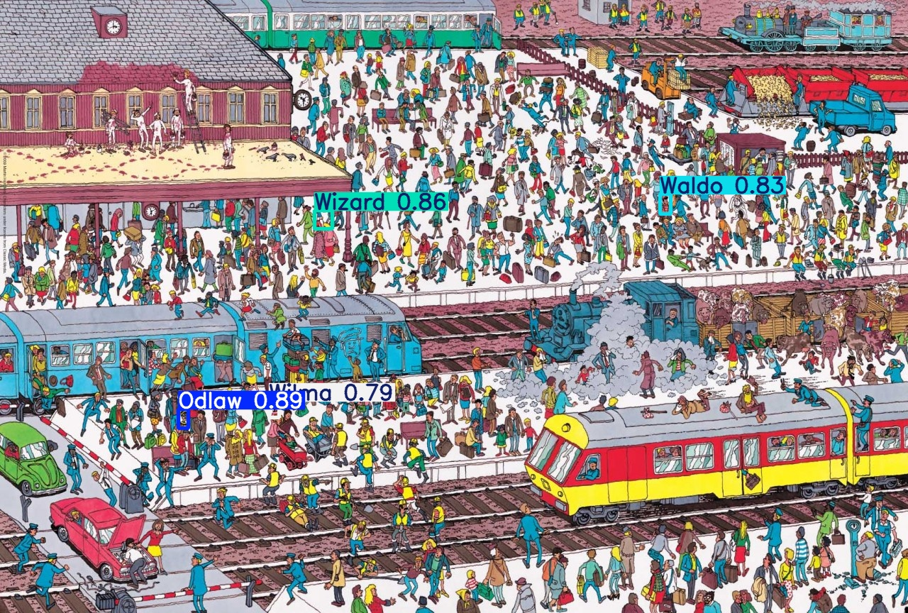

# WaldoFinderPro

  

   
   Single-Class Pretraining + Multi-Class Fine-Tuning for Robust Waldo Detection 

  <b>Authors:</b> Sanjay Srinivasan, Roshini Gopinath  

---

## 🔎 Project Description

The *Where’s Waldo?* books present a unique challenge for object detection: Waldo is often small, occluded, and surrounded by thousands of distractors.  

Our project leverages **YOLOv11x** in a two-stage training strategy:  
1. **Single-Class Training (1C):** Train YOLOv11x on Waldo only.  
2. **Multi-Class Fine-Tuning (4C):** Initialize from the best 1C weights and fine-tune on Waldo, Odlaw, Wilma, and Wizard.  

This pipeline significantly reduced **false positives**, as the detector learned to differentiate Waldo from visually similar characters (especially Odlaw).  

  
   
  <em>Figure 1: Multi-class setup with Waldo, Wilma, Odlaw, and Wizard.</em>

---

## 🎯 Objectives

- Pretrain a strong Waldo-only detector as a base model.  
- Fine-tune the detector on **Waldo + look-alike characters** to reduce false positives.  
- Evaluate improvements in **precision, recall, mAP@50, and F1**.  
- Validate performance on unseen Waldo puzzle pages with cluttered backgrounds.  
- Demonstrate the benefit of **single-class pretraining + multi-class fine-tuning**.  

---

## 📂 Dataset

- **Source:** Full-page Waldo puzzle scans  
- **Annotations:** YOLO format (`cls, x_center, y_center, width, height`)  
- **Resizing:** 1280 px resolution for training  
- **Augmentation:** Mosaic, flips, copy-paste  
- **Splits:** Train 70%, Validation 20%, Test 10%  

**Dataset challenges:**  
- Waldo often < 24 px tall → tiny object detection problem.  
- Heavy occlusion in crowded backgrounds.  
- Look-alike distractors (Odlaw’s striped shirt).  
- Computational cost of full-page training at high resolution.  

---

## ⚙️ Methodology

**Stage 1: Single-Class Training (1C)**  
- Model: YOLOv11x pretrained on COCO  
- Target: Waldo only  
- Output: `best_1c.pt` (used as initialization for 4C)  

**Stage 2: Multi-Class Fine-Tuning (4C)**  
- Input: best 1C weights  
- Classes: Waldo, Odlaw, Wilma, Wizard  
- Goal: teach the detector to recognize Waldo and distinguish him from look-alikes  

**Evaluation Metrics:**  
Precision • Recall • mAP@50 • F1 score  

---

## 📊 Results & Analysis

| Metric     | 1C Model | 4C Fine-Tuned Model | Gain |
|------------|----------|----------------------|------|
| Precision  | ~0.90    | **~0.95**           | ✅   |
| Recall     | ~0.80    | **~0.85**           | ✅   |
| mAP@50     | ~0.88    | **~0.95**           | ✅   |
| F1 Score   | ~0.85    | **~0.90**           | ✅   |

**Key Insight:**  
The fine-tuned multi-class model achieved **higher precision** by learning about Odlaw, Wilma, and Wizard, thereby reducing false positives that plagued the 1C setup.  

  
   
  <em>Figure 2: 1C training curves — stable convergence with good accuracy, but prone to false positives.</em>

  
   
  <em>Figure 3: 4C fine-tuning curves — higher variability, but stronger final performance across metrics.</em>

  
   
  <em>Figure 4: Precision-Recall curve — Waldo AP = 0.867, showing strong balance between precision and recall after fine-tuning.</em>

  
   
  <em>Figure 5: F1-Confidence curve — peak F1 ~0.85 at conf ≈0.28.</em>

---

## 🖼️ Qualitative Predictions

  
   
  <em>Figure 6: Fine-tuned 4C model detecting Waldo (0.84), Wilma (0.77), Odlaw (0.89), Wizard (0.90) in a banquet scene — demonstrating robustness in extreme clutter.</em>

  
   
  <em>Figure 7: 4C model detecting all characters in a train station scene (Waldo 0.83, Odlaw 0.89, Wilma 0.79, Wizard 0.86). Fine-tuning reduced Waldo/Odlaw confusion.</em>

**Takeaways:**  
- 1C → strong base model, but higher false positives.  
- 4C fine-tuning → **better precision and reliability** in cluttered real-world images.  
- Small (<24 px) Waldo instances remain a challenge.  

---

## 🚧 Challenges

- Detecting very small Waldo instances.  
- Heavy occlusion in busy scenes.  
- False positives in 1C setup due to Odlaw similarity.  
- Higher GPU memory cost at 1280 px training.  

---

## 🚀 Future Work

1. **Tiling + TTA** — improve recall for tiny Waldo detections.  
2. **Transformer-based models** — DETR/YOLO-DETR hybrids for complex backgrounds.  
3. **Interactive Web Demo** — upload a Waldo puzzle and get detections in real time.  
4. **Dataset Expansion** — more Waldo books for generalization.  
5. **Explainability** — use Grad-CAM/heatmaps to interpret model focus.  

---

## 📚 References  

1. C.-Y. Wang, A. Bochkovskiy, H.-Y. M. Liao. *YOLOv7: Trainable Bag-of-Freebies Sets New State-of-the-Art for Real-Time Object Detectors.* arXiv:2207.02696 (2022).  
2. Stanford CS231n Project (2024). *A Novel Approach to Solving “Where’s Waldo” (WaldoNet).*  
3. Author(s). (2025). *High-Precision Multi-Class Object Detection Using Fine-Tuned YOLOv11.* SAI Conference.  

---

## ✉️ Contact

📧 **Sanjay Srinivasan** – sanjaynivasan@gmail.com  
📧 **Roshini Gopinath** – roshini.gopinath@gmail.com  
